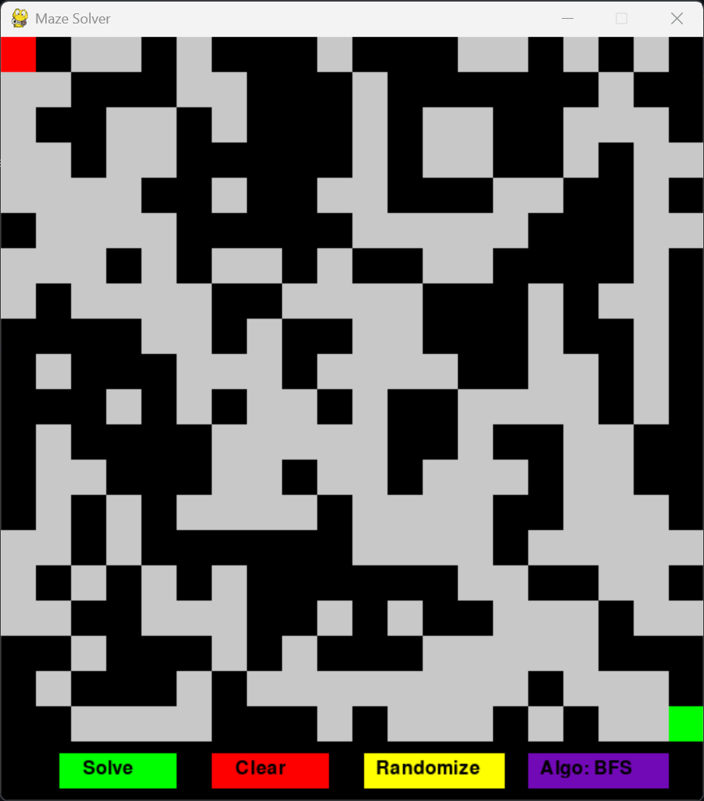
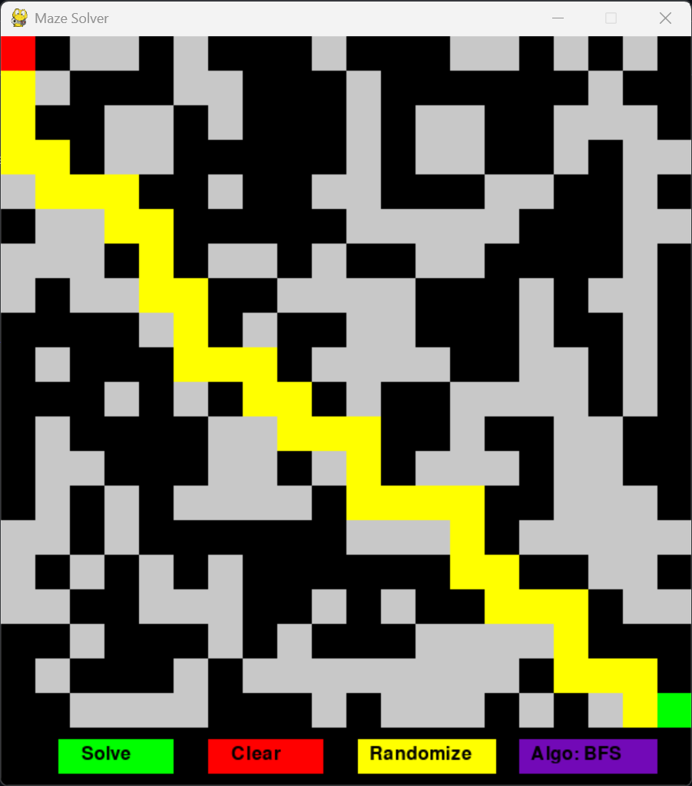
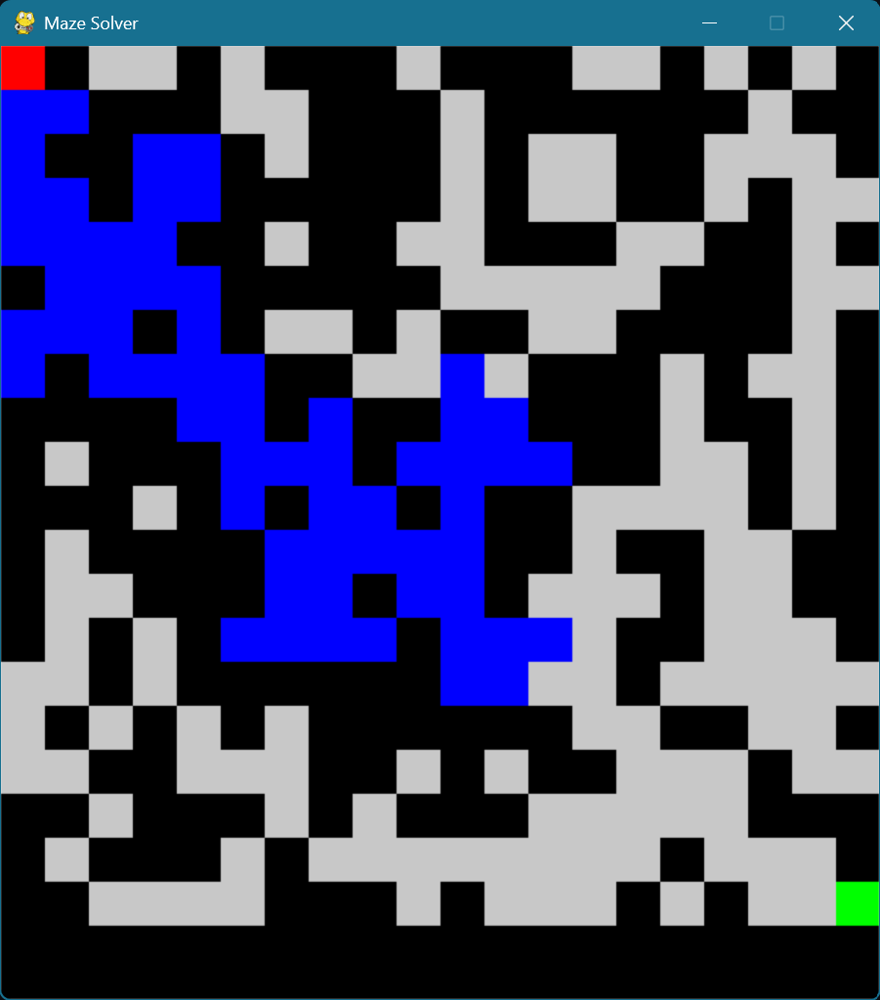

# 🧩 Maze Solver Visualization



*A random maze with start point (red) and end point (green)*

## 📋 Overview

This interactive Python application visualizes how different pathfinding algorithms navigate through randomly generated mazes. Built with Pygame, it provides a clear and engaging way to understand how algorithms like DFS, BFS, A*, and Dijkstra work in real-time.

## ✨ Features

- **Dynamic Maze Generation**: Creates random solvable mazes with guaranteed paths
- **Multiple Pathfinding Algorithms**:
  - 🔍 **Depth-First Search (DFS)** - Explores as far as possible along each branch before backtracking
  - 🌊 **Breadth-First Search (BFS)** - Explores all neighbor nodes at the present depth before moving deeper
  - 🌟 **A* Search** - Uses heuristics to find the most efficient path
  - 🗺️ **Dijkstra's Algorithm** - Finds the shortest path based on cumulative edge weights
- **Real-time Visualization**: Watch as algorithms explore the maze
- **Interactive Controls**: Switch algorithms and generate new mazes on the fly

## 🎮 Demo

### Solution Path


*The yellow path shows the solution found by the BFS algorithm*

### Exploration Process


*Blue cells show areas explored by the algorithm before finding the solution*

## 🛠️ Installation

1. Ensure you have Python 3.6+ installed
2. Install Pygame:
   ```bash
   pip install pygame
   ```
3. Clone this repository or download the script

## 🚀 Usage

Run the application:

```bash
python maze_solver.py
```

### Controls


*The application's control panel with Solve, Clear, and Randomize buttons*

- **Solve** - Start solving the maze with the selected algorithm
- **Clear** - Reset the current solution
- **Randomize** - Generate a new maze
- **Algo** - Toggle between different algorithms (DFS, BFS, A*, Dijkstra)

## 🎨 Visual Guide

| Element | Color | Description |
|---------|-------|-------------|
| ⬛ Black | Walls | Obstacles that cannot be traversed |
| ⬜ White/Gray | Paths | Open spaces that can be traversed |
| 🟥 Red | Start | The starting position (top-left) |
| 🟩 Green | End | The destination (bottom-right) |
| 🟦 Blue | Visited | Nodes that have been explored |
| 🟨 Yellow | Final Path | The discovered solution path |

### Algorithm Colors

| Algorithm | Color |
|-----------|-------|
| DFS | Pink (`#f72585`) |
| BFS | Purple (`#7209b7`) |
| A* | Dark Blue (`#3a0ca3`) |
| Dijkstra | Light Blue (`#4361ee`) |

## 💡 How It Works

1. **Maze Generation**: The application creates a random maze with guaranteed path from start to end
2. **Algorithm Selection**: Choose which pathfinding algorithm to visualize
3. **Path Discovery**: Watch in real-time as the algorithm explores the maze
4. **Solution**: Once the end is reached, the final shortest path is highlighted in yellow

## 📊 Algorithm Comparison

| Algorithm | Strengths | Weaknesses | Best Use Case |
|-----------|-----------|------------|---------------|
| DFS | Memory efficient, can find solutions in deep mazes | May not find shortest path, can get stuck in infinite paths | Mazes with long corridors and few branches |
| BFS | Always finds shortest path in unweighted graphs | Memory intensive | Small to medium-sized mazes |
| A* | Efficient for large mazes, finds shortest path | More complex implementation | Large mazes with clear paths |
| Dijkstra | Finds shortest path considering weights | Explores all directions | Weighted mazes where shortest distance matters |

## 🧠 Educational Value

This visualization tool is excellent for:
- Learning fundamental graph traversal algorithms
- Understanding heuristic-based pathfinding
- Visualizing algorithm efficiency differences
- Introducing computer science concepts through engaging visuals

## 🔧 Technical Details

The application uses:
- **Pygame** for graphics and user interface
- **Heapq** for priority queue implementation (A* and Dijkstra)
- **Random** for maze generation
- **Time** module for controlled animation speed

## 🚀 Future Improvements

- Add ability to manually draw walls
- Include more advanced algorithms (Bidirectional search, Jump Point Search)
- Add options to adjust animation speed
- Implement maze generation algorithms (Recursive backtracking, Prim's, etc.)
- Allow custom heuristic functions

## 📄 License

This project is open-source and available under the MIT License.

## 👥 Contributions

Contributions, issues, and feature requests are welcome! Feel free to check the issues page.
